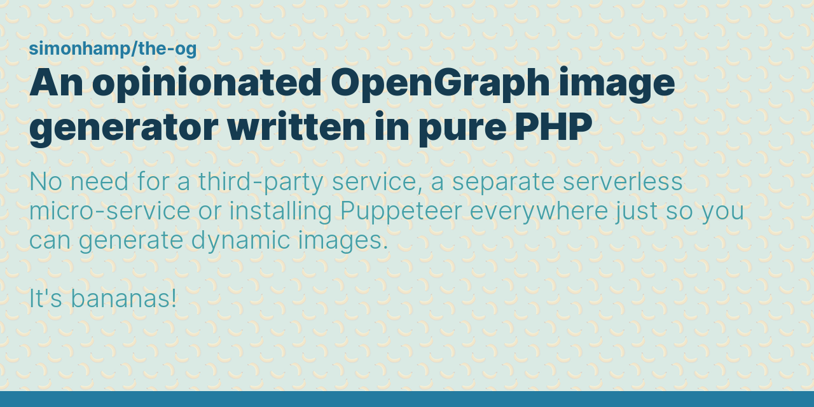

# The OG

An OpenGraph image generator written purely in PHP, so you don't need to install another runtime somewhere
or a whole browser instance just to create a dynamic PNG.

## Sponsorship
The OG is completely free to use for personal or commercial use. If it's making your job easier or you just want to
make sure it keeps being supported and improved, I'd really appreciate your donations!

[Donate now via GitHub Sponsors](https://github.com/sponsors/simonhamp)

Thank you 🙏

## Sponsors

[Laradir](https://laradir.com/?ref=laravel-nov-csv-import-github) - Connecting the best Laravel Developers with the best Laravel Teams

## Installation

Install via Composer:

```shell
composer require simonhamp/the-og --with-all-dependencies
```

## Usage

Using The OG is really simple. Here's a basic example:

```php
use SimonHamp\TheOg\Image;
use SimonHamp\TheOg\Background;

(new Image())
    ->accentColor('#cc0000')
    ->border()
    ->url('https://example.com/blog/some-blog-post-url')
    ->title('Some blog post title that is quite big and quite long')
    ->description('Some slightly smaller but potentially much longer subtext. It could be really long so we might need to trim it completely after many words')
    ->background(Background::JustWaves, 0.2)
    ->save(__DIR__.'/test.png');
```

And here's the image that generates:


### Themes

Themes set the colors, fonts, and styles for your image. There are currently 2 themes available: `Light` and `Dark`.
The default theme is `Light`.

You can set the theme on your image at any point before it's rendered:

```php
$image = new Image;
$image->theme(Theme::Dark);
```

#### Creating themes

Themes are simple classes. You can create your own theme simply by extending the `AbstractTheme` class:

```php
use SimonHamp\TheOg\Themes\AbstractTheme;

$theme = new class(
    accentColor: '#247BA0',
    backgroundColor: '#ECEBE4',
    baseColor: '#153B50',
    baseFont: Font::InterBold,
    callToActionBackgroundColor: '#153B50',
    callToActionColor: '#ECEBE4',
    descriptionColor: '#429EA6',
    descriptionFont: Font::InterLight,
    titleFont: Font::InterBlack,
) extends AbstractTheme {};

$image = new Image;
$image->theme($theme);
```

Colors can be expressed as hex codes, rgba, or HTML named colors.

Currently, there are currently 4 fonts available, all within the Inter family. More fonts are coming soon!

#### Overriding theme settings

You can override some theme settings, such as the accent color and background color, without having to create a whole
new theme.

```php
$image = new Image;
$image->backgroundColor('seagreen');
```

### Layouts

While themes govern colors and styles, layouts govern sizing and positioning of your images and the elements within
them.

There are currently 2 layouts: `Standard` and `GitHubBasic`. `Standard` is the default.

More layouts are coming.

## Testing

There's a basic test script in `tests/test.php`. You can execute this directly from the command line:

```shell
php tests/test.php
```

But a more robust test suite is needed and is coming.

## Contributing

I'd really appreciate and welcome any PRs to help improve this package!

<!-- Please see [CONTRIBUTING](CONTRIBUTING.md) for details. -->

## License

The MIT License (MIT). Please see [LICENSE](LICENSE) for more details.
